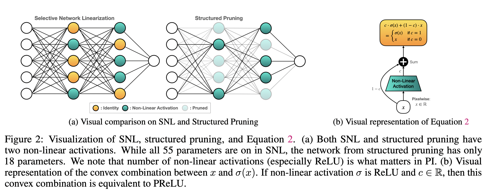
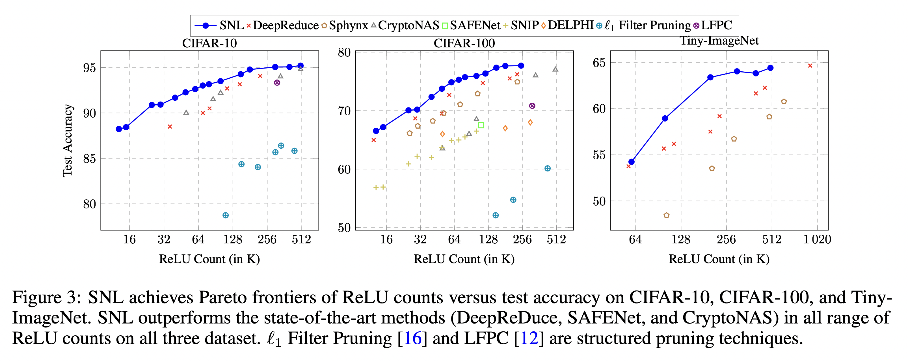

# Selective Network Linearization for Efficient Private Inference - Published in ICML 2022

## Author: Minsu Cho, Ameya Joshi, Siddharth Garg, Brandon Reagen, Chinmay Hegde

This is the official code for our paper Selective Network Linearization for Efficient Private Inference published in ICML 2022. 

<p>

</p>

### Setup

Basic Requirements:

1. pytorch == 1.1.0
2. torchvision == 0.12.0
3. numpy == 1.21.5

<p>

</p>

### Instructions

This is the instructions for the ResNet18 on CIFAR100 with ReLU count 100k.

1. Train the ResNet18 model: 
```
bash ./scripts/train_resnet18_c100.sh
```
2. Run SNL code with the saved models from Step 1.
```
bash ./scripts/snl_resnet18_c100_relu_100k.sh
```

The other examples for different relu counts are
```
bash ./scripts/snl_resnet18_c100_relu_25k.sh
bash ./scripts/snl_resnet18_c100_relu_50k.sh
```


